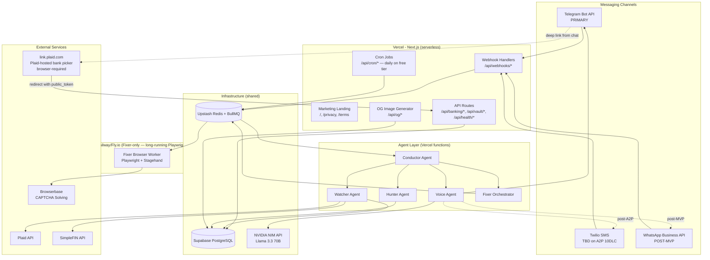
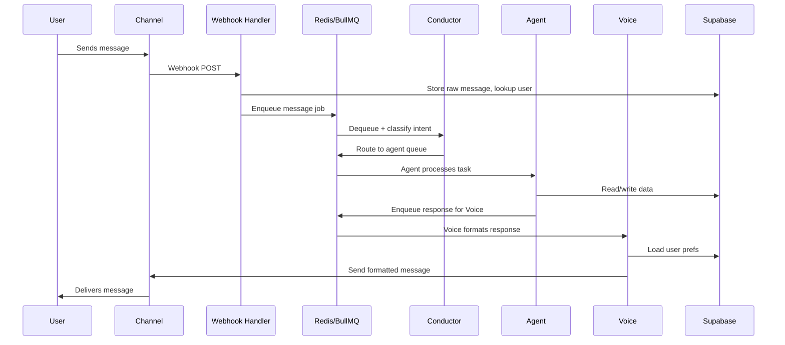
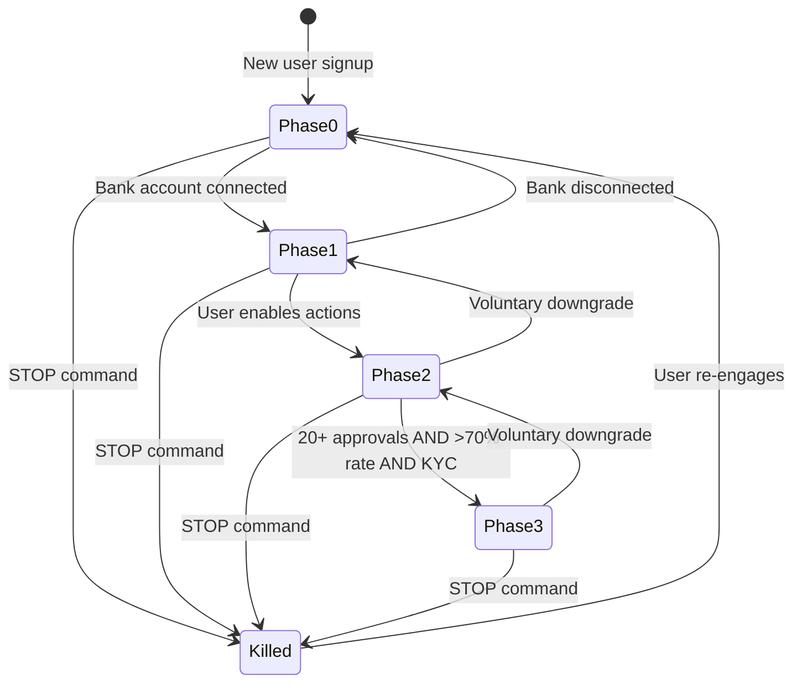
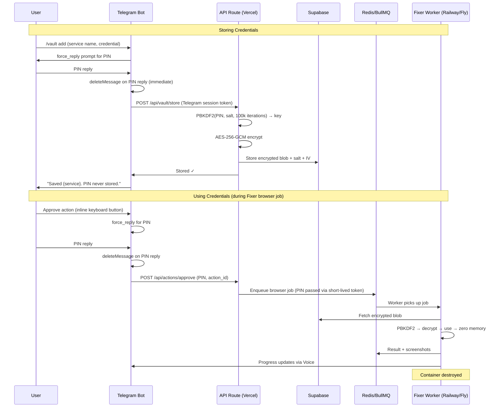
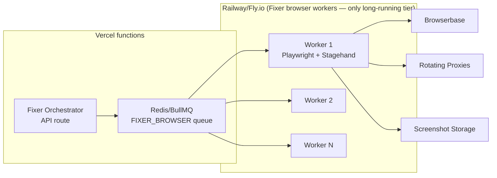

# Design Document — RealValue AI Financial Agent

## Overview

RealValue is a chat-first multi-agent financial assistant. **Telegram is the primary channel.** SMS via Twilio is the alternative channel (currently `[TBD on use]` pending Twilio A2P 10DLC carrier approval). WhatsApp is post-MVP. Five specialized agents (Conductor, Watcher, Fixer, Hunter, Voice) collaborate behind a single conversational personality to cancel subscriptions, predict overdrafts, find government benefits, negotiate bills, and fight for every dollar users leave on the table.

The system is built on Next.js (Vercel) + Supabase (PostgreSQL) + Redis/BullMQ, with **only the Fixer browser worker** running on a dedicated Railway/Fly.io container (Playwright sessions take minutes — required by Requirement 5.1). All other agents run as Vercel serverless functions (sub-10s per job).

**Users interact exclusively through chat — there is no authenticated web portal.** All flows that originally went through a web UI (bank linking, settings, credential vault, billing, data export, kill switch, couples linking) are Telegram chat commands and inline keyboards. The public web surface is limited to a marketing landing (`/`), legal pages (`/privacy`, `/terms`), and server-side webhook/API endpoints. The `(portal)` directory and `/login` page were deleted in task 2.8 (commit `adc85d9`); see Requirement 22 for the forcing function preventing reintroduction.

The MVP (V1) is the Subscription Assassin: connect bank → Watcher finds unused subs → user says "cancel it" → Fixer cancels → shareable card.

### Key Design Decisions

| Decision | Choice | Rationale |
|----------|--------|-----------|
| Agent communication | Redis pub/sub + BullMQ job queues | Decoupled agents, reliable delivery, retry logic, dead-letter queues |
| Messaging abstraction | Channel adapter pattern | Unified interface across Telegram/WhatsApp/SMS with platform-specific rendering |
| Browser automation | Playwright + Stagehand on Railway/Fly.io | Long-running containers (not serverless), anti-bot stealth, CAPTCHA solving — **Fixer-only**: all other agents run as Vercel serverless functions |
| Financial math | PostgreSQL NUMERIC + Decimal.js | Never IEEE 754 — exact arithmetic for all money operations |
| State machine | Trust Ladder in Supabase + Redis cache | Phase transitions with guardrail enforcement, kill switch |
| Credential security | AES-256 + PIN-derived key + ephemeral containers | Zero-knowledge vault — system can't decrypt without user PIN |
| Job scheduling | Vercel cron → BullMQ queues → Vercel functions consume per-invocation | BullMQ is queue+retry primitive (not long-running-worker requirement). Fixer queue consumed by Railway/Fly worker; all others by Vercel functions. Vercel free-tier cron is daily; upgradable to 6h on Pro. |
| User interface | Telegram bot only (MVP). No web portal. | Eliminates portal maintenance, session management, and a hostile UX surface. SMS post-A2P; WhatsApp post-MVP. |

## Architecture

### High-Level System Architecture



*Diagram notes:*
- *Solid arrows are MVP-active. Dotted arrows are post-A2P (SMS) or post-MVP (WhatsApp).*
- *`PLAID_LINK` is Plaid's hosted page on `link.plaid.com` — not a page we host. The user taps a deep link in Telegram, completes Plaid's flow on Plaid's domain, and Plaid redirects back to our server-side `/api/banking/plaid-callback` endpoint with the `public_token`.*
- *BullMQ is used as a queue+retry primitive. Conductor / Watcher / Hunter / Voice / Fixer Orchestrator workers run as Vercel function invocations (one job per invocation, sub-10s). Only `FIXER_WORKER` is a long-running dyno, holding per-provider Redis semaphores.*
- *No portal node. The marketing landing is non-load-bearing — it has no edges into the agent layer because users transition to chat to interact.*

### Request Flow — Message Lifecycle




## Components and Interfaces

### 1. Agent Communication Protocol

Agents communicate via Redis pub/sub channels and BullMQ job queues. Each agent has:
- An **input queue** (BullMQ) for task processing with retry logic
- A **pub/sub channel** (Redis) for real-time events (kill switch, priority changes, health pings)
- A **response queue** that feeds into the Voice agent for user-facing output

```typescript
// Inter-agent message envelope
interface AgentMessage {
  id: string;                    // UUID v4
  timestamp: string;             // ISO 8601
  sourceAgent: 'conductor' | 'watcher' | 'fixer' | 'hunter' | 'voice';
  targetAgent: 'conductor' | 'watcher' | 'fixer' | 'hunter' | 'voice';
  userId: string;
  type: 'task' | 'response' | 'event' | 'priority_change' | 'health';
  priority: 'critical' | 'high' | 'normal' | 'low';
  payload: Record<string, unknown>;
  correlationId: string;         // Links related messages across agents
  ttl: number;                   // Seconds before message expires
}

// BullMQ queue names
const QUEUES = {
  INBOUND: 'inbound-messages',
  CONDUCTOR: 'conductor-tasks',
  WATCHER: 'watcher-tasks',
  FIXER: 'fixer-tasks',
  HUNTER: 'hunter-tasks',
  VOICE: 'voice-outbound',
  FIXER_BROWSER: 'fixer-browser-jobs',
  DEAD_LETTER: 'dead-letter',
} as const;
```

**Conflict Resolution Protocol**: When multiple agents produce recommendations for the same financial decision, the Conductor collects all recommendations within a 5-second window, scores them against the user's current life-stage priorities (stored in `user_preferences`), and emits a single unified recommendation to the Voice.

**Conductor Failover**: If the Conductor misses 3 consecutive health pings (10s intervals), each agent switches to autonomous mode using last-known priority configuration cached in Redis. When the Conductor recovers, it replays missed events from the append-only `agent_event_logs` table.

### 2. Messaging Channel Abstraction

The Voice agent uses a channel adapter pattern to abstract across Telegram, WhatsApp, and SMS:

```typescript
interface ChannelAdapter {
  sendText(userId: string, text: string): Promise<MessageResult>;
  sendImage(userId: string, imageUrl: string, caption?: string): Promise<MessageResult>;
  sendActionButtons(userId: string, text: string, buttons: ActionButton[]): Promise<MessageResult>;
  sendProgressUpdate(userId: string, step: string, progress: number): Promise<MessageResult>;
}

interface ActionButton {
  id: string;
  label: string;
  callbackData: string;
}

interface MessageResult {
  success: boolean;
  messageId?: string;
  channel: 'telegram' | 'whatsapp' | 'sms';
  fallbackUsed: boolean;
}
```

**Fallback Logic**: If the primary channel fails, the Voice retries on SMS within 30 seconds. The `ChannelRouter` selects the primary channel based on subscription tier (Free → Telegram, Premium → WhatsApp) and user preference overrides.

### 3. Conductor Agent

```typescript
interface ConductorAgent {
  classifyIntent(message: UserMessage): Promise<IntentClassification>;
  routeToAgent(intent: IntentClassification, userId: string): Promise<void>;
  detectLifeChange(userId: string, transactions: Transaction[]): Promise<LifeChangeEvent | null>;
  shiftPriorities(userId: string, event: LifeChangeEvent): Promise<void>;
  activateSurvivalMode(userId: string): Promise<void>;
  deactivateSurvivalMode(userId: string): Promise<void>;
  collectRecommendations(userId: string, windowMs: number): Promise<AgentRecommendation[]>;
  resolveConflict(recs: AgentRecommendation[], priorities: UserPriorities): AgentRecommendation;
  checkAgentHealth(): Promise<AgentHealthReport>;
  redistributeTasks(failedAgent: AgentType): Promise<void>;
  logEvent(event: AgentEvent): Promise<void>;
}

interface IntentClassification {
  intent: 'cancel_subscription' | 'check_balance' | 'find_benefits' | 'ask_question'
    | 'approve_action' | 'reject_action' | 'snooze_action' | 'stop_command'
    | 'pause_command' | 'change_mode' | 'general_chat';
  confidence: number;
  targetAgent: AgentType;
  extractedEntities: Record<string, string>;
}
```

### 4. Watcher Agent

```typescript
interface WatcherAgent {
  categorizeTransaction(tx: RawTransaction): Promise<CategorizedTransaction>;
  runDetectors(userId: string, newTransactions: Transaction[]): Promise<Insight[]>;
  predictOverdraft(userId: string): Promise<OverdraftPrediction | null>;

  // 9 detector types
  detectUnusedSubscriptions(userId: string): Promise<Insight[]>;
  detectBillIncreases(userId: string): Promise<Insight[]>;
  detectTrialExpirations(userId: string): Promise<Insight[]>;
  detectLifestyleInflation(userId: string): Promise<Insight[]>;
  detectAnomalousTransactions(userId: string, newTx: Transaction): Promise<Insight | null>;
  detectCostCreep(userId: string): Promise<Insight[]>;
  detectRecurringCharges(userId: string): Promise<RecurringCharge[]>;
  detectBehavioralPatterns(userId: string): Promise<Insight[]>;
  detectForgottenTrials(userId: string): Promise<Insight[]>;

  generateGhostAction(userId: string, insight: Insight): Promise<GhostAction>;
}

interface OverdraftPrediction {
  predictedDate: string;
  projectedShortfall: string;     // Decimal string, never float
  currentBalance: string;
  projectedExpenses: string;      // With 20% buffer applied
  suggestedActions: string[];
  confidence: number;
}
```

### 5. Fixer Agent

```typescript
interface FixerAgent {
  executeAction(action: ApprovedAction): Promise<ActionResult>;

  // 4-step fallback chain
  attemptBrowserAutomation(action: ApprovedAction): Promise<ActionResult>;
  attemptApiIntegration(action: ApprovedAction): Promise<ActionResult>;
  generateGuidedWalkthrough(action: ApprovedAction): Promise<GuidedWalkthrough>;
  generateHumanDelegation(action: ApprovedAction): Promise<DelegationKit>;

  // Guardrails
  checkCompatibilityDatabase(provider: string): Promise<CompatibilityScore>;
  enforcePhaseGuardrails(userId: string, action: ApprovedAction): Promise<GuardrailResult>;
  verifyPreActionState(action: ApprovedAction): Promise<StateVerification>;
  enforceDestructiveDelay(action: ApprovedAction): Promise<boolean>;

  // Browser job dispatch (to Railway/Fly.io)
  dispatchBrowserJob(job: BrowserJob): Promise<string>;
  pollBrowserJobStatus(jobId: string): Promise<BrowserJobStatus>;
}

interface BrowserJob {
  jobId: string;
  userId: string;
  actionId: string;
  provider: string;
  actionType: 'cancel' | 'negotiate' | 'apply' | 'transfer';
  credentialVaultEntryId?: string;
  maxRetries: number;
  screenshotAtEveryStep: true;
}

interface BrowserJobStatus {
  jobId: string;
  status: 'queued' | 'running' | 'navigating' | 'authenticating'
    | 'executing' | 'verifying' | 'complete' | 'failed';
  currentStep: string;
  screenshots: string[];
  result?: ActionResult;
  error?: string;
}
```

### 6. Hunter Agent

```typescript
interface HunterAgent {
  searchGovernmentBenefits(profile: UserFinancialProfile): Promise<BenefitOpportunity[]>;
  searchBetterRates(userId: string): Promise<RateOpportunity[]>;
  searchRefunds(userId: string): Promise<RefundOpportunity[]>;
  searchCheaperAlternatives(userId: string): Promise<AlternativeOpportunity[]>;

  filterByImmigrationStatus(opps: Opportunity[], status: ImmigrationStatus): Opportunity[];
  filterByReligiousPreferences(opps: Opportunity[], prefs: ReligiousPreferences): Opportunity[];
  filterAffiliates(opps: Opportunity[], enabled: boolean): Opportunity[];
  rankBySavings(opps: Opportunity[]): Opportunity[];
}

interface BenefitOpportunity {
  programName: string;
  estimatedMonthlyValue: string;    // Decimal string
  eligibilityRequirements: string[];
  applicationUrl: string;
  requiresCitizenship: boolean;
  requiresLegalResidency: boolean;
}
```

### 7. Voice Agent

```typescript
interface VoiceAgent {
  formatMessage(content: AgentContent, userId: string): Promise<FormattedMessage>;
  applyPersonalityMode(content: string, mode: PersonalityMode, locale: string): Promise<string>;
  detectSentiment(message: string): Promise<SentimentResult>;
  shouldAutoShiftToZen(sentiment: SentimentResult): boolean;

  applySafeMode(message: FormattedMessage, coverTopic: string): FormattedMessage;
  applyStealthMode(message: FormattedMessage): FormattedMessage;
  applySimplifiedMode(message: FormattedMessage): FormattedMessage;

  getTemplateFallback(templateKey: string, vars: Record<string, string>): string;
  assembleMorningBriefing(userId: string): Promise<FormattedMessage>;
  isUrgent(insight: Insight): boolean;
}

type PersonalityMode = 'savage' | 'hype' | 'zen' | 'mentor';

interface SentimentResult {
  sentiment: 'positive' | 'neutral' | 'anxious' | 'distressed' | 'grief' | 'crisis';
  confidence: number;
  triggerKeywords: string[];
}
```

### 8. Trust Ladder State Machine



```typescript
interface TrustLadder {
  getCurrentPhase(userId: string): Promise<TrustPhase>;
  advancePhase(userId: string, trigger: PhaseTrigger): Promise<PhaseTransitionResult>;
  downgradePhase(userId: string, targetPhase: TrustPhase): Promise<PhaseTransitionResult>;
  executeKillSwitch(userId: string): Promise<KillSwitchResult>;
  checkPhase3Eligibility(userId: string): Promise<Phase3EligibilityCheck>;
}

type TrustPhase = 'phase_0' | 'phase_1' | 'phase_2' | 'phase_3' | 'killed';

interface KillSwitchResult {
  tokensRevoked: boolean;
  vaultLocked: boolean;
  operationsHalted: boolean;
  confirmationSent: boolean;
  totalTimeMs: number;           // Must be < 5000ms
}

// Phase guardrails
const PHASE_GUARDRAILS = {
  phase_0: { canExecuteActions: false },
  phase_1: { canExecuteActions: false, ghostActionsEnabled: true },
  phase_2: {
    canExecuteActions: true,
    perActionLimit: '25.00',
    dailyAggregateLimit: '100.00',
    requiresApproval: true,
  },
  phase_3: {
    canExecuteActions: true,
    tier1: { autoExecute: true, maxAmount: '10.00', mustBeReversible: true },
    tier2: { autoExecute: true, notifyUser: true, undoWindowHours: 24 },
    tier3: { requiresApproval: true },
  },
} as const;
```

### 9. Credential Vault



**Security Properties**:
- PIN never stored — only used transiently for key derivation
- PBKDF2 with 100,000 iterations + random salt per credential
- AES-256-GCM provides authenticated encryption (tamper detection)
- Decrypted credentials exist only in ephemeral container memory
- Container destroyed after each automation session

### 10. Browser Automation Infrastructure



*Only the browser-automation tier requires a long-running host. **Conductor / Watcher / Voice / Hunter / Fixer-orchestrator** all run as Vercel function invocations consuming their respective BullMQ queues per-invocation (each job <10s).*

**Worker Lifecycle**:
1. Worker polls `fixer-browser-jobs` queue
2. Checks Compatibility Database — skip to next fallback if success rate < 50%
3. Spins up headless Playwright with Stagehand + residential proxy
4. Decrypts credentials from vault using provided PIN
5. Executes automation with screenshots at every step
6. Uploads screenshots to Supabase Storage
7. Reports result back to Redis
8. Zeros credential memory, container destroyed

**Concurrency Control**: Max 10 concurrent sessions per provider via Redis semaphore (`provider:{name}:sessions` counter with TTL).

### 11. Insight Detection Pipeline

The Watcher processes transactions through 9 detector types:

```typescript
const DETECTOR_PIPELINE: Detector[] = [
  new RecurringChargeDetector(),
  new UnusedSubscriptionDetector(),     // 45+ days no usage
  new BillIncreaseDetector(),           // >10% increase
  new TrialExpirationDetector(),        // Trial ending within 3 days
  new LifestyleInflationDetector(),     // Category >15% above 3-month avg
  new AnomalousTransactionDetector(),   // >3x average for merchant/category
  new CostCreepDetector(),             // Aggregate small increases
  new BehavioralPatternDetector(),
  new ForgottenTrialDetector(),
];

interface Detector {
  name: string;
  detect(userId: string, txs: Transaction[], ctx: DetectorContext): Promise<Insight[]>;
}
```

**Two-Pass Categorization**:
- Pass 1: Rule-based matching (500+ merchant/category rules) — fast, deterministic
- Pass 2: LLM-assisted for unmatched transactions (NVIDIA NIM, batched)
- Target: 95% categorization accuracy

### 12. Notification Batching

```typescript
interface MorningBriefing {
  deliveryTime: string;           // User's preferred time, default 8:00 AM local
  overnightInsights: Insight[];
  pendingActions: PendingAction[];
  dailySnapshot: {
    currentBalance: string;       // Decimal string
    yesterdaySpending: string;
    upcomingBills: UpcomingBill[];
    overdraftRisk: 'none' | 'low' | 'medium' | 'high';
  };
  ghostActionTotal?: string;      // Phase 1 — running missed savings total
}

// Urgent bypass — delivered immediately
const URGENT_TYPES = [
  'overdraft_prediction',
  'anomalous_transaction',
  'security_alert',
  'kill_switch_confirmation',
  'action_failure',
] as const;
```

Batching rule: max 3-5 messages per day. Morning briefing + action requests. Urgent notifications bypass batching.

### 13. Shareable Card Generation

```typescript
interface ShareableCardGenerator {
  generateActionCard(action: CompletedAction): Promise<ShareableCard>;
  generateWeeklySummary(userId: string): Promise<ShareableCard>;
  generateMonthlySummary(userId: string): Promise<ShareableCard>;
  generateMilestoneCard(userId: string, milestone: SavingsMilestone): Promise<ShareableCard>;
}

interface ShareableCard {
  imageUrl: string;               // @vercel/og rendered (1200x630)
  shortUrl: string;               // Unique short URL with referral tracking
  referralCode: string;
  inviteLink: string;
}
```

**OG Image Route**: `GET /api/og/card/[cardId]` — renders via `@vercel/og` (ImageResponse). Card data fetched from Supabase by `cardId`. No user financial data in URL.

**Short URL**: `GET /r/[code]` — redirects to signup, tracks referral in `referrals` table.

### 14. API Routes

```
# Marketing & legal (public, no auth — see Requirement 22)
GET  /                                # Marketing landing (currently a stub)
GET  /privacy                         # Privacy policy (required for A2P 10DLC)
GET  /terms                           # Terms & SMS conditions (required for A2P 10DLC)

# Webhooks (server-side handlers, no auth — signature-verified)
POST /api/webhooks/telegram           # PRIMARY chat ingress
POST /api/webhooks/whatsapp           # post-MVP
POST /api/webhooks/twilio             # post-A2P
POST /api/webhooks/plaid
POST /api/webhooks/simplefin
POST /api/webhooks/telegram-payment   # Telegram Payments API: pre_checkout_query, successful_payment

# Cron (Vercel cron — daily on free tier, upgradable to 6h on Pro)
GET  /api/cron/bank-sync
GET  /api/cron/morning-briefing
GET  /api/cron/overdraft-check
GET  /api/cron/agent-health
GET  /api/cron/survival-mode-check

# Auth (SMS magic-link — [TBD on use], gated on Twilio A2P 10DLC)
POST /api/auth/magic-link             # [TBD on use] until A2P clears
POST /api/auth/verify                 # [TBD on use] until A2P clears
# Telegram-resolved sessions are issued at webhook time in 2.1 — no separate endpoint

# Bank Linking (called from Telegram chat handlers; no portal pages)
POST /api/banking/plaid-callback      # exchange Plaid public_token from link.plaid.com redirect
GET  /api/banking/accounts            # list (Telegram /accounts handler)
DELETE /api/banking/unlink/:id        # Telegram inline-button unlink

# Credential Vault (called from Telegram /vault chat handlers — auth: Telegram-resolved session)
POST /api/vault/store
GET  /api/vault/list
PUT  /api/vault/update/:id
DELETE /api/vault/delete/:id

# Actions (called from Telegram inline-button callbacks)
POST /api/actions/approve
POST /api/actions/reject
POST /api/actions/snooze
POST /api/actions/cancel-pending

# Trust Ladder (called from Telegram chat command handlers)
GET  /api/trust/status
POST /api/trust/advance
POST /api/trust/downgrade
POST /api/trust/kill-switch

# Settings (called from Telegram chat command handlers — no settings page)
GET  /api/settings
PUT  /api/settings
PUT  /api/settings/personality
PUT  /api/settings/safe-mode
PUT  /api/settings/blocked-merchants
PUT  /api/settings/phone-number

# Shareable Cards
GET  /api/og/card/[cardId]            # OG image render via @vercel/og
GET  /r/[code]                        # short URL → signup with referral attribution

# Couples Mode (called from Telegram /link_partner / /accept_partner)
POST /api/couples/link
POST /api/couples/accept
DELETE /api/couples/unlink

# Health & Export
GET  /api/health                      # Supabase + Redis ping
GET  /api/health/integration          # Supabase write/read + Redis set/get
GET  /api/health/banking              # Plaid sandbox + SimpleFIN demo round-trip
GET  /api/health/auth                 # Twilio creds + From number; ?phone= sends real SMS
GET  /api/health/agents               # per-agent metrics
# Data export delivered as Telegram document attachment via /export_data chat command — no /api/export/data web download
```


## Data Models

All monetary values use PostgreSQL `NUMERIC(19,4)` — never IEEE 754 floating point. All tables enforce row-level security (RLS) for user isolation. Soft deletes (`is_deleted`, `deleted_at`) instead of cascading hard deletes. The `action_logs` table is append-only (no UPDATE/DELETE).

### Core Tables

```sql
-- Users: identified by telegram_user_id (canonical, set at webhook time in 2.1)
-- or phone_number (SMS auth, [TBD on use] until A2P clears).
-- phone_number is UNIQUE NULLABLE — Telegram-only users may have NULL phone
-- until they opt into SMS post-A2P. Reframed 2026-04-29 in the Telegram-first pivot.
CREATE TABLE users (
  id UUID PRIMARY KEY DEFAULT gen_random_uuid(),
  phone_number VARCHAR(20) UNIQUE,             -- nullable; populated when SMS auth opts in
  telegram_user_id VARCHAR(64) UNIQUE,         -- canonical identity at webhook time
  whatsapp_number VARCHAR(20),
  display_name VARCHAR(100),
  trust_phase VARCHAR(10) NOT NULL DEFAULT 'phase_0'
    CHECK (trust_phase IN ('phase_0','phase_1','phase_2','phase_3','killed')),
  subscription_tier VARCHAR(10) NOT NULL DEFAULT 'free'
    CHECK (subscription_tier IN ('free','premium','hardship')),
  personality_mode VARCHAR(10) NOT NULL DEFAULT 'mentor'
    CHECK (personality_mode IN ('savage','hype','zen','mentor')),
  locale VARCHAR(10) DEFAULT 'en-US',
  safe_mode_enabled BOOLEAN DEFAULT FALSE,
  safe_mode_code_word VARCHAR(50),
  safe_mode_cover_topic VARCHAR(20) DEFAULT 'weather',
  stealth_mode_enabled BOOLEAN DEFAULT FALSE,
  simplified_mode_enabled BOOLEAN DEFAULT FALSE,
  survival_mode_active BOOLEAN DEFAULT FALSE,
  survival_mode_activated_at TIMESTAMPTZ,
  is_minor BOOLEAN DEFAULT FALSE,
  immigration_status_confirmed BOOLEAN DEFAULT FALSE,
  immigration_eligible BOOLEAN,
  religious_finance_prefs JSONB DEFAULT '[]',
  notification_pause_until TIMESTAMPTZ,
  morning_briefing_time TIME DEFAULT '08:00',
  timezone VARCHAR(50) DEFAULT 'America/New_York',
  affiliates_enabled BOOLEAN DEFAULT TRUE,
  kyc_verified BOOLEAN DEFAULT FALSE,
  kyc_verified_at TIMESTAMPTZ,
  phase2_approval_count INTEGER DEFAULT 0,
  phase2_total_actions INTEGER DEFAULT 0,
  trusted_contact_phone VARCHAR(20),
  onboarding_completed BOOLEAN DEFAULT FALSE,
  is_deleted BOOLEAN DEFAULT FALSE,
  deleted_at TIMESTAMPTZ,
  created_at TIMESTAMPTZ DEFAULT NOW(),
  updated_at TIMESTAMPTZ DEFAULT NOW()
);

CREATE INDEX idx_users_phone ON users(phone_number);
CREATE INDEX idx_users_telegram ON users(telegram_user_id) WHERE telegram_user_id IS NOT NULL;
CREATE INDEX idx_users_whatsapp ON users(whatsapp_number) WHERE whatsapp_number IS NOT NULL;

-- Bank Connections
CREATE TABLE bank_connections (
  id UUID PRIMARY KEY DEFAULT gen_random_uuid(),
  user_id UUID NOT NULL REFERENCES users(id),
  provider VARCHAR(10) NOT NULL CHECK (provider IN ('plaid','simplefin')),
  access_token_encrypted TEXT NOT NULL,
  institution_name VARCHAR(100),
  institution_id VARCHAR(50),
  status VARCHAR(20) NOT NULL DEFAULT 'active'
    CHECK (status IN ('active','disconnected','error','revoked')),
  last_sync_at TIMESTAMPTZ,
  is_deleted BOOLEAN DEFAULT FALSE,
  deleted_at TIMESTAMPTZ,
  created_at TIMESTAMPTZ DEFAULT NOW(),
  updated_at TIMESTAMPTZ DEFAULT NOW()
);

CREATE INDEX idx_bank_conn_user ON bank_connections(user_id) WHERE is_deleted = FALSE;

-- Accounts
CREATE TABLE accounts (
  id UUID PRIMARY KEY DEFAULT gen_random_uuid(),
  user_id UUID NOT NULL REFERENCES users(id),
  bank_connection_id UUID NOT NULL REFERENCES bank_connections(id),
  account_id_external VARCHAR(100) NOT NULL,
  account_name VARCHAR(100),
  account_type VARCHAR(20),
  account_mask VARCHAR(4),
  current_balance NUMERIC(19,4),
  available_balance NUMERIC(19,4),
  currency VARCHAR(3) DEFAULT 'USD',
  is_deleted BOOLEAN DEFAULT FALSE,
  deleted_at TIMESTAMPTZ,
  created_at TIMESTAMPTZ DEFAULT NOW(),
  updated_at TIMESTAMPTZ DEFAULT NOW()
);

CREATE INDEX idx_accounts_user ON accounts(user_id) WHERE is_deleted = FALSE;

-- Transactions
CREATE TABLE transactions (
  id UUID PRIMARY KEY DEFAULT gen_random_uuid(),
  user_id UUID NOT NULL REFERENCES users(id),
  account_id UUID NOT NULL REFERENCES accounts(id),
  transaction_id_external VARCHAR(100),
  amount NUMERIC(19,4) NOT NULL,
  merchant_name VARCHAR(200),
  merchant_category VARCHAR(100),
  category_rule_matched VARCHAR(100),
  category_confidence NUMERIC(5,4),
  description TEXT,
  transaction_date DATE NOT NULL,
  posted_at TIMESTAMPTZ,
  is_recurring BOOLEAN DEFAULT FALSE,
  recurring_charge_id UUID,
  is_deleted BOOLEAN DEFAULT FALSE,
  deleted_at TIMESTAMPTZ,
  created_at TIMESTAMPTZ DEFAULT NOW()
);

CREATE INDEX idx_tx_user_date ON transactions(user_id, transaction_date DESC) WHERE is_deleted = FALSE;
CREATE INDEX idx_tx_merchant ON transactions(user_id, merchant_name) WHERE is_deleted = FALSE;

-- Recurring Charges
CREATE TABLE recurring_charges (
  id UUID PRIMARY KEY DEFAULT gen_random_uuid(),
  user_id UUID NOT NULL REFERENCES users(id),
  merchant_name VARCHAR(200) NOT NULL,
  amount NUMERIC(19,4) NOT NULL,
  previous_amount NUMERIC(19,4),
  frequency VARCHAR(20) NOT NULL
    CHECK (frequency IN ('weekly','biweekly','monthly','quarterly','annual')),
  next_expected_date DATE,
  last_charged_date DATE,
  last_usage_date DATE,
  days_since_usage INTEGER,
  is_trial BOOLEAN DEFAULT FALSE,
  trial_end_date DATE,
  status VARCHAR(20) NOT NULL DEFAULT 'active'
    CHECK (status IN ('active','unused','cancelled','paused')),
  is_deleted BOOLEAN DEFAULT FALSE,
  deleted_at TIMESTAMPTZ,
  created_at TIMESTAMPTZ DEFAULT NOW(),
  updated_at TIMESTAMPTZ DEFAULT NOW()
);

CREATE INDEX idx_recurring_user ON recurring_charges(user_id) WHERE is_deleted = FALSE;

-- Agent Actions
CREATE TABLE agent_actions (
  id UUID PRIMARY KEY DEFAULT gen_random_uuid(),
  user_id UUID NOT NULL REFERENCES users(id),
  agent VARCHAR(20) NOT NULL,
  action_type VARCHAR(30) NOT NULL,
  target_merchant VARCHAR(200),
  target_account_id UUID REFERENCES accounts(id),
  estimated_savings NUMERIC(19,4),
  actual_savings NUMERIC(19,4),
  financial_impact NUMERIC(19,4),
  status VARCHAR(20) NOT NULL DEFAULT 'pending'
    CHECK (status IN ('pending','approved','executing','delayed','complete',
                       'failed','rejected','snoozed','cancelled')),
  approval_required BOOLEAN DEFAULT TRUE,
  approved_at TIMESTAMPTZ,
  executed_at TIMESTAMPTZ,
  destructive_delay_until TIMESTAMPTZ,
  fallback_method VARCHAR(20),
  tier VARCHAR(10),
  undo_window_until TIMESTAMPTZ,
  is_ghost BOOLEAN DEFAULT FALSE,
  screenshots JSONB DEFAULT '[]',
  error_message TEXT,
  correlation_id UUID,
  is_deleted BOOLEAN DEFAULT FALSE,
  deleted_at TIMESTAMPTZ,
  created_at TIMESTAMPTZ DEFAULT NOW(),
  updated_at TIMESTAMPTZ DEFAULT NOW()
);

CREATE INDEX idx_actions_user_status ON agent_actions(user_id, status) WHERE is_deleted = FALSE;
CREATE INDEX idx_actions_pending ON agent_actions(user_id) WHERE status = 'pending' AND is_deleted = FALSE;

-- Action Logs (APPEND-ONLY)
CREATE TABLE action_logs (
  id UUID PRIMARY KEY DEFAULT gen_random_uuid(),
  user_id UUID NOT NULL REFERENCES users(id),
  action_id UUID REFERENCES agent_actions(id),
  agent VARCHAR(20) NOT NULL,
  action_type VARCHAR(30) NOT NULL,
  target VARCHAR(200),
  approval_status VARCHAR(20),
  screenshot_refs JSONB DEFAULT '[]',
  outcome VARCHAR(20),
  details JSONB,
  created_at TIMESTAMPTZ DEFAULT NOW()
);
-- No UPDATE or DELETE grants — append-only enforcement
CREATE INDEX idx_action_logs_user ON action_logs(user_id);

-- Ghost Actions
CREATE TABLE ghost_actions (
  id UUID PRIMARY KEY DEFAULT gen_random_uuid(),
  user_id UUID NOT NULL REFERENCES users(id),
  insight_type VARCHAR(30) NOT NULL,
  description TEXT NOT NULL,
  estimated_savings NUMERIC(19,4) NOT NULL,
  target_merchant VARCHAR(200),
  created_at TIMESTAMPTZ DEFAULT NOW()
);

CREATE INDEX idx_ghost_user ON ghost_actions(user_id);

-- Overdraft Predictions
CREATE TABLE overdraft_predictions (
  id UUID PRIMARY KEY DEFAULT gen_random_uuid(),
  user_id UUID NOT NULL REFERENCES users(id),
  predicted_date DATE NOT NULL,
  predicted_shortfall NUMERIC(19,4) NOT NULL,
  current_balance NUMERIC(19,4) NOT NULL,
  projected_expenses NUMERIC(19,4) NOT NULL,
  safety_buffer_applied NUMERIC(5,4) NOT NULL,
  suggested_actions JSONB NOT NULL DEFAULT '[]',
  confidence NUMERIC(5,4) NOT NULL,
  actual_outcome VARCHAR(20),
  guarantee_claimed BOOLEAN DEFAULT FALSE,
  guarantee_amount NUMERIC(19,4),
  created_at TIMESTAMPTZ DEFAULT NOW(),
  updated_at TIMESTAMPTZ DEFAULT NOW()
);

CREATE INDEX idx_overdraft_user ON overdraft_predictions(user_id);

-- Credential Vault Entries
CREATE TABLE credential_vault_entries (
  id UUID PRIMARY KEY DEFAULT gen_random_uuid(),
  user_id UUID NOT NULL REFERENCES users(id),
  service_name VARCHAR(100) NOT NULL,
  service_url VARCHAR(500),
  encrypted_blob BYTEA NOT NULL,
  salt BYTEA NOT NULL,
  iv BYTEA NOT NULL,
  auth_tag BYTEA NOT NULL,
  is_locked BOOLEAN DEFAULT FALSE,
  is_deleted BOOLEAN DEFAULT FALSE,
  deleted_at TIMESTAMPTZ,
  created_at TIMESTAMPTZ DEFAULT NOW(),
  updated_at TIMESTAMPTZ DEFAULT NOW()
);

CREATE INDEX idx_vault_user ON credential_vault_entries(user_id) WHERE is_deleted = FALSE;

-- Notification Queue
CREATE TABLE notification_queue (
  id UUID PRIMARY KEY DEFAULT gen_random_uuid(),
  user_id UUID NOT NULL REFERENCES users(id),
  notification_type VARCHAR(30) NOT NULL,
  urgency VARCHAR(10) NOT NULL CHECK (urgency IN ('immediate','batched')),
  content JSONB NOT NULL,
  channel VARCHAR(10),
  delivered BOOLEAN DEFAULT FALSE,
  delivered_at TIMESTAMPTZ,
  batched_for DATE,
  created_at TIMESTAMPTZ DEFAULT NOW()
);

CREATE INDEX idx_notif_pending ON notification_queue(user_id, batched_for)
  WHERE delivered = FALSE AND urgency = 'batched';

-- Shareable Cards
CREATE TABLE shareable_cards (
  id UUID PRIMARY KEY DEFAULT gen_random_uuid(),
  user_id UUID NOT NULL REFERENCES users(id),
  card_type VARCHAR(20) NOT NULL
    CHECK (card_type IN ('action','weekly_summary','monthly_summary','milestone')),
  action_id UUID REFERENCES agent_actions(id),
  card_data JSONB NOT NULL,
  short_code VARCHAR(20) UNIQUE NOT NULL,
  referral_code VARCHAR(20) NOT NULL,
  image_url TEXT,
  click_count INTEGER DEFAULT 0,
  created_at TIMESTAMPTZ DEFAULT NOW()
);

CREATE INDEX idx_cards_code ON shareable_cards(short_code);

-- Referrals
CREATE TABLE referrals (
  id UUID PRIMARY KEY DEFAULT gen_random_uuid(),
  referrer_user_id UUID NOT NULL REFERENCES users(id),
  referred_user_id UUID REFERENCES users(id),
  shareable_card_id UUID REFERENCES shareable_cards(id),
  referral_code VARCHAR(20) NOT NULL,
  status VARCHAR(20) NOT NULL DEFAULT 'clicked'
    CHECK (status IN ('clicked','signed_up','active')),
  created_at TIMESTAMPTZ DEFAULT NOW(),
  updated_at TIMESTAMPTZ DEFAULT NOW()
);

CREATE INDEX idx_referrals_code ON referrals(referral_code);

-- Subscription Tiers
CREATE TABLE subscription_tiers (
  id UUID PRIMARY KEY DEFAULT gen_random_uuid(),
  user_id UUID NOT NULL REFERENCES users(id),
  tier VARCHAR(10) NOT NULL CHECK (tier IN ('free','premium','hardship')),
  price_monthly NUMERIC(19,4) NOT NULL,
  started_at TIMESTAMPTZ DEFAULT NOW(),
  expires_at TIMESTAMPTZ,
  trial_ends_at TIMESTAMPTZ,
  is_active BOOLEAN DEFAULT TRUE,
  created_at TIMESTAMPTZ DEFAULT NOW(),
  updated_at TIMESTAMPTZ DEFAULT NOW()
);

-- Couples Links
CREATE TABLE couples_links (
  id UUID PRIMARY KEY DEFAULT gen_random_uuid(),
  user_a_id UUID NOT NULL REFERENCES users(id),
  user_b_id UUID REFERENCES users(id),
  status VARCHAR(20) NOT NULL DEFAULT 'pending'
    CHECK (status IN ('pending','active','disconnected')),
  invite_code VARCHAR(20) UNIQUE,
  created_at TIMESTAMPTZ DEFAULT NOW(),
  updated_at TIMESTAMPTZ DEFAULT NOW()
);

-- User Preferences
CREATE TABLE user_preferences (
  id UUID PRIMARY KEY DEFAULT gen_random_uuid(),
  user_id UUID NOT NULL REFERENCES users(id) UNIQUE,
  blocked_merchants JSONB DEFAULT '[]',
  primary_channel VARCHAR(10) DEFAULT 'telegram',
  cultural_preferences JSONB DEFAULT '{}',
  financial_goals JSONB DEFAULT '[]',
  life_stage VARCHAR(30),
  life_stage_priorities JSONB DEFAULT '{}',
  created_at TIMESTAMPTZ DEFAULT NOW(),
  updated_at TIMESTAMPTZ DEFAULT NOW()
);

-- Compatibility Scores
CREATE TABLE compatibility_scores (
  id UUID PRIMARY KEY DEFAULT gen_random_uuid(),
  provider_name VARCHAR(200) NOT NULL,
  provider_url VARCHAR(500),
  automation_method VARCHAR(20) NOT NULL,
  success_rate NUMERIC(5,4) NOT NULL,
  last_tested_at TIMESTAMPTZ,
  failure_reason TEXT,
  total_attempts INTEGER DEFAULT 0,
  total_successes INTEGER DEFAULT 0,
  updated_at TIMESTAMPTZ DEFAULT NOW()
);

CREATE UNIQUE INDEX idx_compat_provider ON compatibility_scores(provider_name, automation_method);

-- Agent Event Logs (append-only)
CREATE TABLE agent_event_logs (
  id UUID PRIMARY KEY DEFAULT gen_random_uuid(),
  agent VARCHAR(20) NOT NULL,
  event_type VARCHAR(30) NOT NULL,
  user_id UUID REFERENCES users(id),
  payload JSONB NOT NULL,
  correlation_id UUID,
  created_at TIMESTAMPTZ DEFAULT NOW()
);

CREATE INDEX idx_agent_events_time ON agent_event_logs(created_at DESC);
```

### Row-Level Security (RLS)

> **Note (2026-04-29 pivot):** RLS via `auth.uid()` applies only to Supabase-Auth-issued sessions (the SMS magic-link path, currently `[TBD on use]`). Telegram webhook handlers run server-side with the Supabase **service-role key** and resolve `user_id` from `telegram_user_id` themselves. Per-user authorization for those handlers is enforced **in handler code** before any query — never rely on `auth.uid()` for Telegram-originated requests.

```sql
-- Enable RLS on all user-data tables
ALTER TABLE users ENABLE ROW LEVEL SECURITY;
ALTER TABLE bank_connections ENABLE ROW LEVEL SECURITY;
ALTER TABLE accounts ENABLE ROW LEVEL SECURITY;
ALTER TABLE transactions ENABLE ROW LEVEL SECURITY;
ALTER TABLE recurring_charges ENABLE ROW LEVEL SECURITY;
ALTER TABLE agent_actions ENABLE ROW LEVEL SECURITY;
ALTER TABLE action_logs ENABLE ROW LEVEL SECURITY;
ALTER TABLE ghost_actions ENABLE ROW LEVEL SECURITY;
ALTER TABLE overdraft_predictions ENABLE ROW LEVEL SECURITY;
ALTER TABLE credential_vault_entries ENABLE ROW LEVEL SECURITY;
ALTER TABLE notification_queue ENABLE ROW LEVEL SECURITY;
ALTER TABLE shareable_cards ENABLE ROW LEVEL SECURITY;
ALTER TABLE referrals ENABLE ROW LEVEL SECURITY;
ALTER TABLE subscription_tiers ENABLE ROW LEVEL SECURITY;
ALTER TABLE couples_links ENABLE ROW LEVEL SECURITY;
ALTER TABLE user_preferences ENABLE ROW LEVEL SECURITY;

-- Standard policy: user sees own data + Crew For Two partner data
CREATE POLICY "user_isolation" ON transactions
  FOR ALL USING (
    user_id = auth.uid()
    OR user_id IN (
      SELECT CASE
        WHEN user_a_id = auth.uid() THEN user_b_id
        WHEN user_b_id = auth.uid() THEN user_a_id
      END
      FROM couples_links
      WHERE status = 'active'
        AND (user_a_id = auth.uid() OR user_b_id = auth.uid())
    )
  );

-- Action logs: SELECT + INSERT only (append-only)
CREATE POLICY "action_logs_read" ON action_logs FOR SELECT USING (user_id = auth.uid());
CREATE POLICY "action_logs_insert" ON action_logs FOR INSERT WITH CHECK (TRUE);
```

